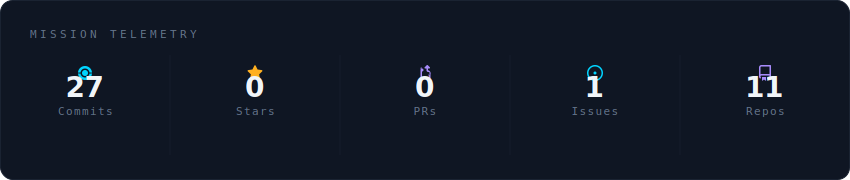

  

 

  

 

  

 

  

 

<strong>Estudante de Análise e Desenvolvimento de Sistemas e Engenharia de Dados
    Experiencia em criação de landing pages, gerenciamento de banco de dados e automação com python</strong>

 

Criando ferramentas que facilitam a vida dos desenvolvedores.
Apaixonado por sistemas distribuídos, experiência do desenvolvedor e o ecossistema de código aberto.

**Currently at** Proz Contagem, MG

 

  
  

